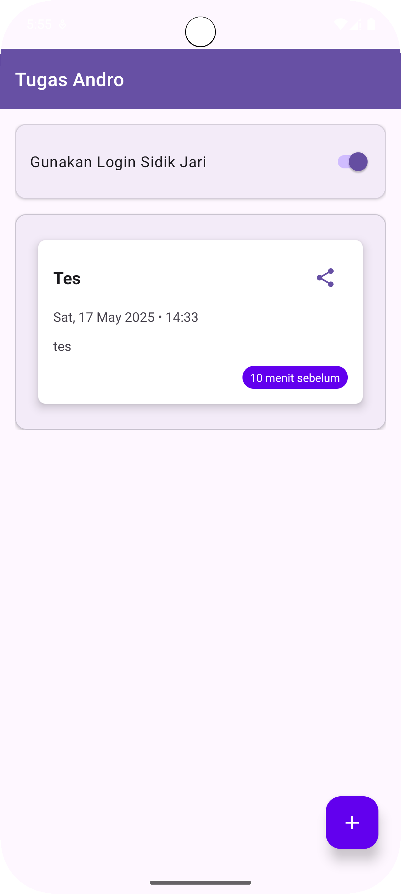
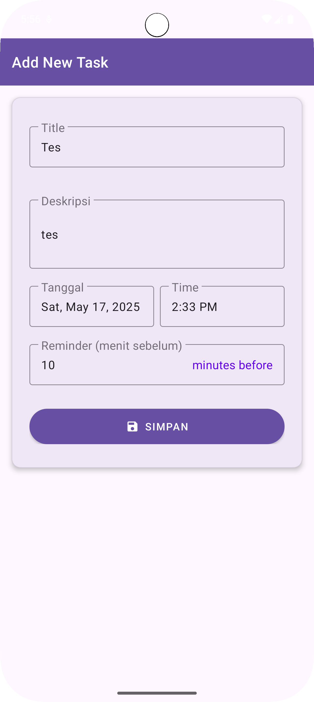

<h1 align="center">📱 Todo - Aplikasi Pengingat Tugas Harian</h1>

<p align="center">
  
  
  
</p>

<p align="center">
Aplikasi manajemen tugas harian dengan autentikasi sidik jari dan sistem pengingat cerdas
</p>

**Todo** adalah aplikasi Android intuitif yang dirancang untuk membantu Anda mengelola tugas harian dengan mudah dan efektif. Dengan fitur pencatatan, pengorganisasian, hingga pengingat yang akurat, Anda tidak akan pernah melewatkan hal penting lagi. Dilengkapi dengan lapisan keamanan tambahan berupa autentikasi sidik jari, data Anda tetap aman dan pribadi.

---

## 🌟 Fitur Utama

<div align="center">
  <table style= background: #5e668d;>
    <tr>
      <td align="center">
        <br>
        <b>Autentikasi Sidik Jari</b><br>
        Login aman dengan fingerprint
      </td>
      <td align="center">
        <br>
        <b>Manajemen Tugas</b><br>
        Buat, edit, dan hapus tugas
      </td>
      <td align="center">
        <br>
        <b>Pengingat Cerdas</b><br>
        Notifikasi tepat waktu
      </td>
    </tr>
    <tr>
      <td align="center">
        <br>
        <b>Tampilan Kartu</b><br>
        UI modern Material Design
      </td>
      <td align="center">
        <br>
        <b>Berbagi Tugas</b><br>
        Ekspor ke aplikasi lain
      </td>
      <td align="center">
        <br>
        <b>Responsif</b><br>
        Dukungan multi-perangkat
      </td>
    </tr>
  </table>
</div>

## ✨ Fitur Unggulan

* **🔒 Login Sidik Jari (Biometrik):** Tambahkan lapisan keamanan opsional dengan autentikasi sidik jari untuk menjaga privasi tugas Anda.
* **➕ Manajemen Tugas Komprehensif:**
    * **Judul & Deskripsi:** Catat detail tugas dengan jelas.
    * **Tanggal & Waktu:** Jadwalkan tugas Anda pada waktu yang spesifik.
    * **Pengingat Kustom:** Atur notifikasi pengingat beberapa menit sebelum tugas dimulai.
* **🗃️ Tampilan Tugas yang Rapi:** Lihat semua tugas Anda dalam daftar yang terorganisir dengan antarmuka berbasis kartu yang bersih.
* **⏰ Pengingat Otomatis:** Dapatkan notifikasi tepat waktu untuk setiap tugas yang telah Anda jadwalkan.
* **📤 Bagikan Tugas:** Bagikan detail tugas ke aplikasi lain dengan mudah.

---

## 🖼️ Tampilan Antarmuka

Berikut adalah sekilas tampilan aplikasi Todo:

| Halaman Daftar Tugas                                | Halaman Tambah/Edit Tugas                          |
| :-------------------------------------------------- | :------------------------------------------------- |
|  |  |

---

## 📦 Panduan Instalasi (Untuk Pengembang)

Untuk menjalankan proyek ini di lingkungan pengembangan lokal Anda:

1.  **Clone Repositori:**
    ```bash
    git clone [https://github.com/KizuAnee/Android-Repo-Prak12.git](https://github.com/KizuAnee/Android-Repo-Prak12.git)
    ```

    ```bash
    cd Android-Repo-Prak12
    ```

1.  **Buka di Android Studio:**
    * Buka Android Studio.
    * Pilih `File > Open`, lalu navigasikan ke folder `Android-Repo-Prak12` yang baru saja Anda clone.
    * Tunggu hingga Android Studio selesai menyinkronkan proyek dan mengunduh dependensi yang diperlukan.

2.  **Jalankan Aplikasi:**
    * Hubungkan perangkat Android Anda atau mulai emulator.
    * Klik tombol `Run` (ikon segitiga hijau) di toolbar Android Studio.

---

## ⚙️ Izin Aplikasi

Aplikasi ini memerlukan izin berikut untuk berfungsi dengan optimal:

* `USE_BIOMETRIC`: Diperlukan untuk fungsionalitas autentikasi sidik jari.
* `SCHEDULE_EXACT_ALARM`: Digunakan untuk menjadwalkan notifikasi pengingat yang tepat waktu (khususnya untuk Android 12+).

---

## 📬 Kontak

Jika Anda memiliki pertanyaan, saran, atau ingin berkolaborasi, jangan ragu untuk menghubungi saya:

**Nama:** Muhammad Farros Shofiy

**Instansi:** Universitas Lambung Mangkurat

**Email:** 2310131310005@mhs.ulm.ac.id
